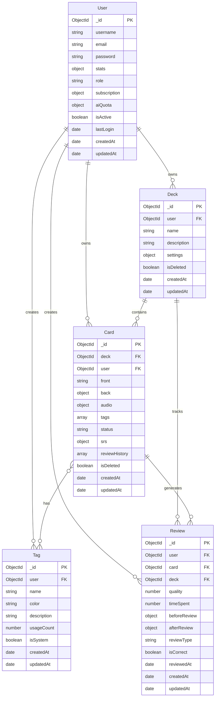

# RabbirVocab

> 一個基於 Anki 改造的智能背單字應用，整合 AI 技術與 FSRS-6 演算法，提供更高效的學習體驗

## 📋 專案簡介

RabbirVocab 是一個現代化的單字學習平台，結合了以下特色：

- 🧠 **FSRS-6 演算法**：採用最新的間隔重複學習演算法，根據遺忘曲線優化複習時機
- 🤖 **AI 輔助功能**：整合 AI 技術，提供智能學習建議與內容生成
- 🎨 **現代化介面**：使用 Vue 3 + TypeScript 打造流暢的使用者體驗
- 📊 **學習統計**：詳細的學習數據分析，追蹤學習進度與成效
- 🔊 **多媒體支援**：支援圖片、音檔等多媒體內容
- 🏷️ **標籤系統**：靈活的標籤管理，方便組織學習內容

## 🗂️ 資料庫架構

### ER 圖



### 資料模型說明

#### User (使用者)
- 管理使用者帳戶資訊、學習統計、訂閱狀態
- 角色類型：`user`、`pro`、`admin`、`super_admin`
- 包含 AI 使用額度管理（日額度/月額度）

#### Deck (卡組)
- 組織卡片的容器，每個卡組可獨立設定學習參數
- 支援 FSRS-6 演算法配置（權重、保留率、學習步驟等）
- 每日新卡片/複習卡片數量限制

#### Card (卡片)
- 核心學習單元，支援 Markdown 格式
- 包含多媒體內容（圖片、音檔）
- FSRS-6 狀態追蹤（穩定度、難度、到期日等）
- 狀態類型：`new`（新卡）、`learning`（學習中）、`review`（複習中）

#### Tag (標籤)
- 靈活的內容分類系統
- 支援自訂顏色和描述
- 追蹤使用次數

#### Review (複習記錄)
- 記錄每次複習的詳細資訊
- 包含複習前後的 FSRS-6 狀態快照
- 用於學習分析和統計

## 🛠️ 技術棧

### 前端
- **框架**: Vue 3 (Composition API)
- **語言**: TypeScript
- **狀態管理**: Pinia
- **路由**: Vue Router
- **樣式**: Tailwind CSS 4
- **建構工具**: Vite 7

### 後端
- **運行環境**: Node.js 20+
- **框架**: Express 5
- **資料庫**: MongoDB (Mongoose ODM)
- **認證**: Express Session + bcryptjs
- **儲存**: AWS S3 (圖片/音檔)
- **語音合成**: edge-tts-universal

### 開發工具
- **測試**: Vitest (單元測試) + Playwright (E2E 測試)
- **程式碼品質**: ESLint + Prettier
- **型別檢查**: vue-tsc

## 📦 安裝與設定

### 環境需求

- Node.js: `^20.19.0` 或 `>=22.12.0`
- MongoDB: 4.4+
- Yarn 或 npm

### 開始使用

```sh
# 安裝依賴
yarn

# 開發模式（前端）
yarn dev

# 開發模式（後端）
yarn server:dev

# 同時啟動前後端開發服務器
yarn dev:all

# 建構專案
yarn build:all

# 生產環境啟動
yarn start:prod
```

## 🧪 測試

```sh
# 單元測試
yarn test:unit

# E2E 測試
yarn test:e2e

# 安裝 Playwright 瀏覽器（首次執行）
npx playwright install
```

## 💡 核心功能

### FSRS-6 演算法
- 基於記憶科學的間隔重複演算法
- 動態調整複習間隔，最大化學習效率
- 支援自訂參數（期望保留率、學習步驟等）

### 學習統計
- 每日學習時間追蹤
- 準確率分析
- 學習連續天數記錄
- 卡片掌握度可視化

### AI 功能
- 智能內容生成
- 學習建議
- 額度管理系統（免費/付費方案）

## 📁 專案結構

```
rabbirvocab/
├── server/              # 後端程式碼
│   ├── models/         # Mongoose 資料模型
│   ├── routes/         # API 路由
│   ├── utils/          # 工具函數（含 FSRS 演算法）
│   └── server.ts       # 伺服器入口
├── src/                # 前端程式碼
│   ├── components/     # Vue 元件
│   ├── stores/         # Pinia 狀態管理
│   ├── views/          # 頁面元件
│   └── router/         # 路由配置
└── public/             # 靜態資源
```

## 🤝 開發指南

### 程式碼風格
```sh
# 執行 Linter
yarn lint

# 格式化程式碼
yarn format
```

### 型別檢查
```sh
yarn type-check
```

## 📄 授權

本專案採用 MIT 授權條款

## 🔗 相關連結

- [Vue 3 文件](https://vuejs.org/)
- [TypeScript 文件](https://www.typescriptlang.org/)
- [Tailwind CSS](https://tailwindcss.com/)
- [MongoDB](https://www.mongodb.com/)
- [FSRS 演算法](https://github.com/open-spaced-repetition/fsrs4anki)

## 📮 IDE 設定建議

[VS Code](https://code.visualstudio.com/) + [Vue (Official)](https://marketplace.visualstudio.com/items?itemName=Vue.volar) (請停用 Vetur)

### 瀏覽器擴充功能

- Chromium 系瀏覽器 (Chrome, Edge, Brave 等):
  - [Vue.js devtools](https://chromewebstore.google.com/detail/vuejs-devtools/nhdogjmejiglipccpnnnanhbledajbpd) 
  - [啟用 Custom Object Formatter](http://bit.ly/object-formatters)
- Firefox:
  - [Vue.js devtools](https://addons.mozilla.org/en-US/firefox/addon/vue-js-devtools/)
  - [啟用 Custom Object Formatter](https://fxdx.dev/firefox-devtools-custom-object-formatters/)

---

Made with ❤️ for better vocabulary learning